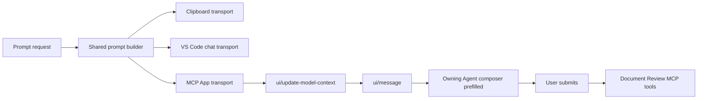

# VS Code Agent App Integration Plan

Status: Proposed

Primary target: VS Code Agent App / Agent Host

Future target: Codex, after the Codex app is available for local development and validation

## 1. Goals

1. Make prompt copying explicit everywhere the extension currently offers an "Ask Copilot" action.
2. Show agent-handoff actions only when the active host supports sending or prefilling a message in the current conversation.
3. Preserve the existing Cursor prompt content and tool naming while replacing its implicit clipboard fallback with an explicit "Copy Prompt" action.
4. Package the portable review workflow as a VS Code Agent Plugin with an MCP server, an Agent Skill, and an MCP App UI.
5. Let the MCP App prefill a review request in the conversation that owns the app by using `ui/message`; the user then submits it.
6. Automate protocol, UI, packaging, and regression testing as far as the available host interfaces allow.

## 2. Non-Goals For This Phase

- Do not add a Codex manifest or Codex-specific runtime code yet.
- Do not use `codex://` deep links.
- Do not integrate with Codex App Server.
- Do not build an Agent Host Protocol client to inject messages into an external session. AHP is still a draft protocol.
- Do not claim that a separate VS Code document webview can address an arbitrary Agent App session. The MCP App can prefill only the composer of its owning conversation, and current VS Code behavior does not auto-submit it.
- Do not remove the existing VS Code extension. The VSIX and Agent Plugin remain complementary products.

## 3. User Experience Contract

### 3.1 Prompt actions

Every surface that currently offers "Ask Copilot" must also support an explicit "Copy Prompt" action.

| Surface | Agent handoff available | Agent handoff unavailable |
|---|---|---|
| Add-comment dialog | `Add Comment`, `Ask Copilot` or `Ask Agent`, `Copy Prompt` | `Add Comment`, `Copy Prompt` |
| Comment popover | `Ask Copilot` or `Ask Agent`, `Copy Prompt` | `Copy Prompt` |
| Comment-list item | `Ask Copilot` or `Ask Agent`, `Copy Prompt` | `Copy Prompt` |
| Bulk toolbar | `Send All to Copilot` or `Send All to Agent`, `Copy Prompt` | `Copy Prompt` |
| Agent MCP App | `Prepare for Agent`, `Copy Prompt` | `Copy Prompt` |

The existing raw-comment copy action may remain, but it should be labeled `Copy Comment` so it cannot be confused with `Copy Prompt`.

### 3.2 Required behavior

- `Copy Prompt` always copies the complete generated prompt, not only the visible comment text.
- Send, composer prefill, and clipboard copy must use the exact same generated prompt text.
- Copying must never silently open or focus a chat.
- A send or prefill failure must never silently fall back to clipboard. Show a failure notification and leave `Copy Prompt` available.
- Unsupported hosts must not render an agent-handoff button.
- Adding a comment through `Copy Prompt` must save the comment before generating its prompt.
- If the existing thread action persists a typed reply before prompting, direct send and copy must preserve the same behavior.
- Prompt generation must retain format-specific instructions for Markdown, Word, and PowerPoint.
- Cursor prompts must continue to use MCP tool names without the VS Code `#` prefix.

## 4. Architecture



### 4.1 Shared prompt request

Introduce a pure prompt-delivery model that is independent of VS Code and MCP:

```ts
interface PromptRequest {
    text: string;
    context: {
        format: 'markdown' | 'docx' | 'pptx';
        filePath: string;
        commentIds: string[];
        mode: 'new' | 'thread' | 'batch';
    };
}

interface PromptDeliveryCapabilities {
  mode: 'send' | 'prefill' | 'none';
  actionLabel?: 'Ask Copilot' | 'Prepare for Agent';
}
```

Send, prefill, and copy consume the same `PromptRequest`. This gives the tests one equality invariant: the clipboard text must equal the text passed through `ui/message` or VS Code chat.

### 4.2 Host adapters

Use explicit adapters instead of embedding host checks in generated HTML:

- `ClipboardPromptTransport`
  - Available in every UI.
  - Copies `PromptRequest.text`.
  - Returns a visible success or failure result.
- `VscodeCopilotPromptTransport`
  - Enabled only when running in VS Code and the direct chat command is available.
  - Disabled in Cursor.
  - Uses the current direct chat behavior without a clipboard fallback.
- `McpAppPromptTransport`
  - Used by the Agent Plugin's MCP App.
  - Sends structured context with `ui/update-model-context`.
  - Prefills the self-contained prompt with `ui/message`.
  - Does not claim to auto-submit; current VS Code behavior requires the user to send the prepared prompt.
  - Handles a denied or unsupported request by reporting the error and retaining `Copy Prompt`.

### 4.3 Native extension tool boundary

The existing VSIX already contributes native tools through `vscode.lm.registerTool`. The Agent Host can route calls to those tools while a VS Code editor window with the extension running is connected.

Native tools cannot be bundled as portable Agent Plugin components. Agent Plugins 1.0 packages portable skills and MCP servers; VS Code currently ignores Agent Plugins client-extension directories. Therefore, native tools require the separately installed VSIX and its extension host.

Use a hybrid ownership model:

- MCP owns durable document operations: list/read/reply/resolve comments, parse OOXML, write edits, and save documents.
- Native VSIX tools own editor-coupled actions: reveal a source location, scroll an open preview, capture an open webview or slide, use active-editor state, and show VS Code dialogs.
- Both wrappers call the same portable core wherever behavior overlaps.
- Do not expose duplicate native and MCP tools with indistinguishable names and descriptions. Keep VS Code-only tools explicitly UI-oriented, or disable the duplicate wrapper when the other transport is active.

### 4.4 Capability policy

Use a single policy value when rendering each UI: `send-and-copy`, `prefill-and-copy`, or `copy-only`.

- VS Code with a usable chat command: `send-and-copy`.
- Cursor: `copy-only`.
- Any unknown extension host: `copy-only`.
- Agent MCP App in a validated Agent App host: `prefill-and-copy`.
- MCP App host without validated `ui/message` behavior: `copy-only`.

Do not infer support only from a button click. Phase 0 must first verify the Agent App's `ui/message` behavior. If the host does not expose a declarative capability, keep composer handoff behind an Agent-App-specific feature flag until that validation is part of the release checklist.

## 5. Planned Repository Layout

```text
src/
  prompt-actions.ts              # Pure prompt request builders and capability types
  prompt-transports.ts           # VS Code-side direct/copy transports
  comment-ui.ts                  # Capability-aware controls
  preview.ts                     # Webview message routing
  document-review-core.ts        # Portable comment/document operations
  mcp-server.ts                  # MCP tools and MCP App resources
  mcp-app-ui.ts                  # Agent App review UI entry point

agent-plugin/
  plugin.json                    # Agent Plugins 1.0 manifest
  mcp.json                       # Portable stdio MCP definition
  skills/
    document-review/
      SKILL.md
  server/
    mcp-server.js                # Bundled output
  ui/
    document-review.html         # Bundled MCP App resource

test/
  test-prompt-actions.js
  test-prompt-action-ui.js
  test-mcp-server.js
  test-mcp-app-bridge.js
  test-agent-plugin-package.js
```

The exact split may be adjusted while implementing, but prompt generation and document operations must not be duplicated between the extension and MCP server.

## 6. Implementation Phases

### Phase 0: Baseline And Agent App Capability Spike

1. Record the current generated prompts for Markdown, Word, PowerPoint, single-comment, thread, and batch modes.
2. Build a minimal MCP App fixture with one button that sends `ui/message`.
3. Install that fixture in the VS Code Agent App and verify:
   - The app renders in the active conversation.
   - `ui/update-model-context` is accepted.
  - `ui/message` fills the composer in that same conversation.
  - The prompt is not auto-submitted and the user remains in control of sending it.
   - The host's behavior while a turn is already active is understood.
4. Record the minimum supported VS Code/Agent App version.
5. Keep the production direct-action feature disabled until this spike passes.

Exit criteria:

- A reproducible fixture demonstrates same-conversation composer prefill.
- A failing or unsupported host produces a deterministic signal that the UI can map to copy-only mode.

### Phase 1: Explicit Copy Prompt Actions In The Existing Extension

Primary files:

- `src/comment-ui.ts`
- `src/preview.ts`
- `test/test-comment-ui.js`

Tasks:

1. Extract prompt construction into a pure module or otherwise expose a pure `PromptRequest` builder.
2. Add capability-aware rendering to the shared popover, list items, and sidebar.
3. Add `Copy Prompt` to both Markdown/Word and PowerPoint add-comment dialogs.
4. Replace `Copy All` with `Copy Prompt` for the generated batch prompt.
5. Rename raw `Copy` to `Copy Comment` if that action is retained.
6. Replace ambiguous webview commands with explicit commands such as:
   - `copyPromptForComment`
   - `copyPromptForNewComment`
   - `copyBatchPrompt`
   - `sendPromptForComment`
   - `sendPromptForNewComment`
   - `sendBatchPrompt`
7. Remove Cursor's clipboard behavior from `sendToChat`.
8. Set Cursor to copy-only before rendering the webview.
9. Ensure the clipboard success message says `Prompt copied to clipboard.` and is non-modal.

Exit criteria:

- Every former Ask Copilot location has `Copy Prompt`.
- Cursor renders no Ask Copilot controls.
- No direct-send code path writes to the clipboard.
- Existing prompt text remains semantically unchanged.

### Phase 2: Portable Document Review Core

Primary files:

- `src/comments.ts`
- `src/docx-parser.ts`
- `src/pptx-parser.ts`
- `src/tools.ts`
- `src/mcp-server.ts`

Tasks:

1. Move shared sidecar CRUD, path resolution, prompt context, and document extraction behind portable functions with no `vscode` import.
2. Make the standalone MCP server parse Word and PowerPoint documents directly instead of requiring an already-open VS Code preview.
3. Return structured MCP results in addition to readable text:
   - Document identity and format.
   - Comment IDs, status, source, anchor/element ID, and replies.
   - Stable error codes for missing files, missing comments, and invalid paths.
4. Add accurate MCP annotations for read-only, mutating, and destructive tools.
5. Keep the existing tool names stable.
6. Replace screenshot/slide-capture placeholder responses or mark those tools unavailable in the Agent Plugin until they work headlessly.
7. Enforce path safety:
   - Canonicalize paths.
   - Restrict access to MCP roots supplied by the host when available.
   - Reject traversal and symlink escapes.
   - Fail closed for writes when no allowed root can be established.

Exit criteria:

- The MCP server can list and read Markdown, Word, and PowerPoint comments in a clean process.
- Mutations persist correctly without a VS Code webview being open.
- The extension and MCP server use the same portable operations.

### Phase 3: Agent MCP App UI And Composer Handoff

Tasks:

1. Add `@modelcontextprotocol/ext-apps` and register an MCP App resource using `text/html;profile=mcp-app`.
2. Add a focused render/open tool, for example `docReview_open_review`, whose metadata references the UI resource.
3. Return a text fallback and `structuredContent` so the workflow remains usable without MCP App rendering.
4. Render comments from structured tool results rather than reading files directly in the iframe.
5. Provide comment navigation, reply, resolve/reopen, and prompt actions through MCP tools.
6. Add `Prepare for Agent` and `Copy Prompt` to the same surfaces defined in Section 3.
7. On `Prepare for Agent`:
   - Build one `PromptRequest`.
   - Call `ui/update-model-context` with its structured context.
   - Call `ui/message` with exactly `PromptRequest.text`.
  - Tell the user that the prompt is ready in the composer and must be submitted.
8. On `Copy Prompt`:
   - Copy exactly `PromptRequest.text`.
   - Request `clipboardWrite` in MCP App resource metadata.
   - If clipboard permission is denied, expose a selectable prompt field and a clear manual-copy state instead of silently failing.
9. Keep the prompt self-contained. `ui/update-model-context` is enrichment, not the only copy of critical information.
10. Preserve authoritative comment state in the MCP server; iframe state is presentation-only.

Exit criteria:

- Clicking `Prepare for Agent` fills the owning Agent conversation's composer without auto-submitting.
- Clicking `Copy Prompt` produces byte-for-byte equivalent prompt text.
- A host without composer handoff receives a copy-only UI.
- The model can complete the review workflow using tool results even when the app UI is unavailable.

### Phase 4: Agent Plugin Packaging

Create an Agent Plugins 1.0 package under `agent-plugin/`:

```json
{
  "$schema": "https://agent-plugins.org/schemas/1.0.0/plugin.schema.json",
  "name": "markdown-review",
  "version": "0.1.0",
  "description": "Review Markdown, Word, and PowerPoint documents with agent-accessible comments and an interactive review UI"
}
```

The portable MCP definition should launch the bundled server without absolute installation paths:

```json
{
  "$schema": "https://agent-plugins.org/schemas/1.0.0/mcp.schema.json",
  "mcpServers": {
    "markdown-review": {
      "type": "stdio",
      "command": "node",
      "args": ["${PLUGIN_ROOT}/server/mcp-server.js"],
      "cwd": "${PLUGIN_ROOT}"
    }
  }
}
```

Tasks:

1. Add a `document-review` skill that defines the review workflow, format-specific editing rules, and the no-auto-resolve policy.
2. Add build scripts that bundle the MCP server and UI, then stage only required files into `agent-plugin/`.
3. Ensure runtime code does not depend on repository `node_modules`.
4. Add source installation instructions for the Agent App.
5. Keep VSIX packaging independent from Agent Plugin packaging.

Exit criteria:

- The staged plugin starts from a copied directory whose path contains spaces.
- The plugin loads without the repository or development dependencies present.
- The Agent App discovers the skill, MCP server, tools, and MCP App resource.

### Phase 5: Documentation And Rollout

1. Update `README.md` with a separate Agent App installation and usage section.
2. Update `DEVELOPMENT.md` with plugin build, validation, and local-install commands.
3. Document the capability behavior:
   - VS Code direct plus copy.
   - Cursor copy-only.
   - Agent MCP App direct plus copy when validated.
4. Add troubleshooting for clipboard permission, MCP startup, and copy-only fallback.
5. Release the plugin behind a preview label until Agent App direct-message testing is stable.

## 7. Automated Test Plan

### 7.1 Pure unit tests

Add `test/test-prompt-actions.js` using the existing esbuild-plus-Node test pattern.

Test matrix:

- Formats: Markdown, Word, PowerPoint.
- Modes: new comment, thread, batch.
- Tool syntax: VS Code `#toolName`, Cursor/MCP `toolName`.
- Comments: sidecar, native Word, native PowerPoint, replies, resolved/open.
- Paths: spaces, Unicode where already supported, CRLF, relative and absolute paths.

Assertions:

- Prompt contains document path, format, comment IDs, context, and required tool instructions.
- No-auto-resolve guidance is retained.
- Direct and copy actions receive the same `PromptRequest.text`.
- Empty and malformed optional fields do not crash prompt generation.

### 7.2 Generated webview UI tests

Extend `test/test-comment-ui.js` and add a Playwright-backed `test/test-prompt-action-ui.js`.

Render each capability mode with a mocked `acquireVsCodeApi` and clipboard implementation.

Assertions for every prompt surface:

- `send-and-copy` renders both send and `Copy Prompt` controls.
- `prefill-and-copy` renders both `Prepare for Agent` and `Copy Prompt` controls.
- `copy-only` renders `Copy Prompt` and no direct control.
- Cursor mode sends no direct-action message.
- Copy controls emit the correct explicit webview command and comment identity.
- Add-and-copy saves the comment before requesting the prompt.
- A pending reply is included consistently in direct and copied thread prompts.
- Bulk copy includes only the intended comments.
- Legacy ambiguous labels are absent where replaced.

Add stable test selectors such as `data-prompt-action="copy"`, `data-prompt-action="direct"`, and `data-prompt-surface="popover|list|dialog|bulk"` rather than testing only visible text.

### 7.3 Extension-side transport tests

Keep capability detection and delivery logic in a pure module with mocked adapters.

Assertions:

- Cursor always resolves to `copy-only`.
- Unknown hosts resolve to `copy-only`.
- VS Code without the chat command resolves to `copy-only`.
- VS Code with the chat command resolves to `direct-and-copy`.
- Direct send never calls clipboard.
- Copy never calls the chat command.
- Direct-send failure is surfaced and does not copy implicitly.

### 7.4 MCP server integration tests

Add `test/test-mcp-server.js` using the MCP SDK client against the bundled stdio server in a child process.

Automate:

1. MCP initialization.
2. `tools/list` schema and annotation validation.
3. Representative calls for list, read, reply, resolve/reopen, and delete.
4. Markdown, Word, and PowerPoint fixtures from a fresh temporary directory.
5. Persistence checks by restarting the server and rereading state.
6. Invalid input, missing file, missing comment, traversal, and symlink-escape cases.
7. Clean shutdown and no protocol output on stderr/stdout outside MCP framing.

### 7.5 MCP App bridge tests

Add `test/test-mcp-app-bridge.js` using Playwright and a deterministic fake MCP App host.

The fake host should:

- Complete `ui/initialize`.
- Send `ui/notifications/tool-input` and `ui/notifications/tool-result`.
- Record `tools/call`, `ui/update-model-context`, and `ui/message` requests.
- Support success, denial, timeout, and unsupported-method responses.

Assertions:

- Structured comment data renders correctly.
- `Prepare for Agent` sends `ui/update-model-context` before `ui/message`.
- `ui/message` text exactly equals the text produced by `Copy Prompt`.
- Composer handoff does not simulate Enter or claim that the prompt was submitted.
- Direct-message denial leaves the comment unchanged and keeps copy available.
- Copy-only mode contains no direct control.
- Tool mutations refresh the authoritative state returned by the server.
- Iframe teardown does not lose server-side comment changes.

### 7.6 Plugin package tests

Add `test/test-agent-plugin-package.js`.

Automate:

- Validate `plugin.json` against the pinned Agent Plugins 1.0 schema.
- Validate `mcp.json` against the matching schema.
- Confirm `${PLUGIN_ROOT}` is used instead of machine-specific paths.
- Confirm every referenced file exists inside the plugin root.
- Reject symlink or path escapes in staged artifacts.
- Copy the plugin to a temporary path containing spaces and launch its stdio server.
- Run `tools/list`, `resources/read` for the MCP App, and one read-only tool call from the staged package.
- Verify the staged package does not resolve dependencies from the repository.

### 7.7 Build and CI commands

Add focused scripts similar to:

```json
{
  "test:prompt-actions": "node test/test-prompt-actions.js",
  "test:prompt-ui": "node test/test-comment-ui.js && node test/test-prompt-action-ui.js",
  "test:mcp": "node test/test-mcp-server.js",
  "test:mcp-app": "node test/test-mcp-app-bridge.js",
  "test:agent-plugin": "node test/test-agent-plugin-package.js",
  "test:agent": "npm run test:prompt-actions && npm run test:prompt-ui && npm run test:mcp && npm run test:mcp-app && npm run test:agent-plugin"
}
```

Add a focused `tsconfig.agent.json` if necessary so the new portable core, MCP server, and MCP App code can be type-checked independently of unrelated existing extension type-check debt.

Recommended CI matrix:

- `windows-latest`: required because Windows is the current development and Agent App target.
- `ubuntu-latest`: verifies that the portable plugin does not accidentally depend on Windows path behavior.
- Node 20 for both jobs.
- Playwright Chromium installed once per job for UI tests.

## 8. Minimal Manual Validation

The following checks remain manual because there is no stable headless Agent App integration-test API yet:

1. Install the staged plugin in the VS Code Agent App from a local source.
2. Start a fresh Agent conversation for this repository.
3. Ask the Agent to open document review for one Markdown, Word, and PowerPoint fixture.
4. Confirm the MCP App renders and stays associated with that conversation.
5. Click `Copy Prompt` and verify the clipboard text matches the expected fixture prompt.
6. Click `Prepare for Agent`, verify the same conversation's composer is populated without clipboard or paste steps, and submit it.
7. Confirm the Agent then calls the expected review tools and leaves the comment open unless explicitly told to resolve it.
8. Open the existing extension in Cursor and verify only `Copy Prompt` is shown at every former Ask Copilot location.
9. Open the existing extension in VS Code and verify direct and copy controls follow the detected capability mode.

Record this smoke test with the tested VS Code version in the release checklist. Keep the manual list small; all payload correctness, protocol ordering, UI visibility, and package integrity should already be covered automatically.

## 9. Acceptance Criteria

- All former Ask Copilot surfaces expose `Copy Prompt`.
- Hosts without send or composer-prefill support show no agent-handoff control.
- Cursor is copy-only and uses its existing unprefixed MCP tool prompt format.
- Send, composer prefill, and copy use identical prompt text.
- No send or prefill path silently writes to the clipboard.
- The Agent Plugin installs independently of the VSIX.
- The MCP App can prefill the owning conversation's composer through `ui/message` in the validated Agent App version; the user explicitly submits it.
- Markdown, Word, and PowerPoint comment workflows work from a clean MCP process.
- Automated tests cover prompt construction, UI capability modes, MCP tools, the MCP App bridge, path safety, and staged plugin startup.
- The complete automated Agent test command passes on Windows before manual smoke testing.

## 10. Suggested Pull Request Sequence

1. PR 1: Prompt request model, explicit Copy Prompt controls, and Cursor copy-only behavior.
2. PR 2: Portable document-review core and standalone MCP parity.
3. PR 3: MCP App UI, `ui/message` composer handoff, and bridge tests.
4. PR 4: Agent Plugin package, schema/package tests, and CI.
5. PR 5: Documentation, preview rollout, and release smoke-test evidence.

Each PR should keep its own focused automated suite green before the next phase starts.

## 11. Future Codex Phase

Start this phase only after the Codex app is installed and can be tested locally.

Candidate work:

- Add the Codex-specific plugin manifest while reusing the same skill, MCP server, MCP App, and prompt contract.
- Run Codex host compatibility tests for MCP Apps and `ui/message`.
- Add Codex package/install validation to CI where supported.
- Evaluate Codex App Server only if a future requirement needs an external application to create or resume Codex threads automatically.
- Keep deep links out unless a later UX decision explicitly adopts composer-prefill behavior.

Codex work must not change the Agent App behavior or weaken the copy-only fallback contract.