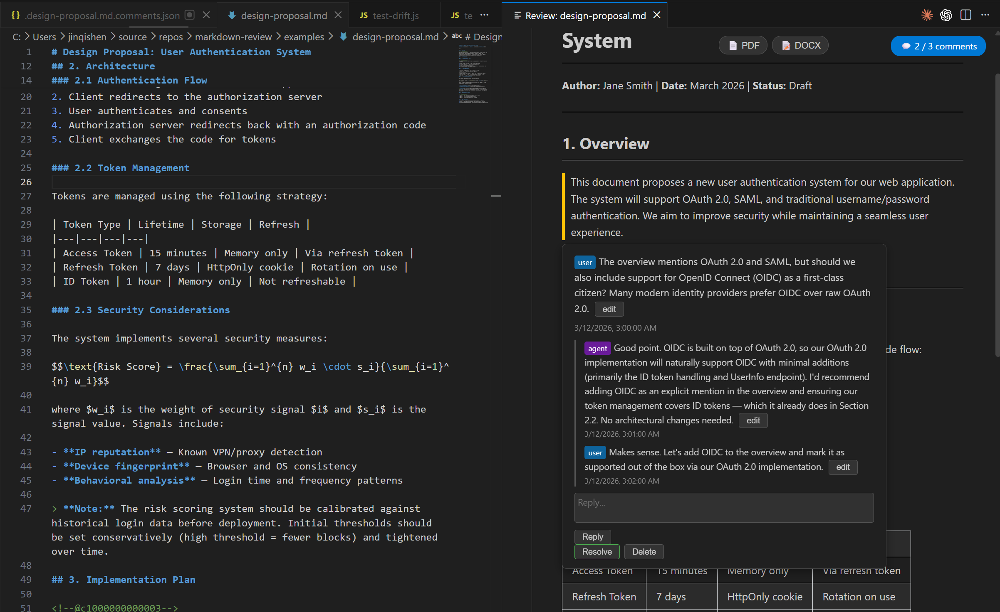

# Markdown Review

**The most agent-friendly markdown review extension for VS Code.**

<!--@c1773463771697-->
Markdown Review brings Quip/Google Docs-style inline commenting to your markdown files — directly inside VS Code. Add comments, reply in threads, resolve discussions, and let AI agents participate in the review via 7 built-in Copilot tools. Perfect for document reviews, design proposals, and technical specifications.

[](https://opensource.org/licenses/MIT)

---

## Quick Start

### 1. Open a Review Preview
Open any `.md` file and press **`Ctrl+Shift+R`** (Mac: `Cmd+Shift+R`), or right-click → **"Markdown Review: Open Preview with Comments"**.

### 2. Add Review Comments
In the preview, click the **`+`** button in the gutter next to any block (heading, paragraph, table, formula, list, blockquote) to add a comment. Reply to comments, edit them, or mark them resolved — all inline.

### 3. Enable AI Agent Tools
In **Copilot Agent Mode** (the chat panel), click the **Tools** button and enable the 7 Markdown Review tools (they start with `#listReviewComments`, `#readReviewComment`, etc.). Now you can ask the agent:
> *"Review this document and respond to all open comments"*

The agent will list comments, read context, post replies, and resolve items — all autonomously.

---

## Features



### Rich Rendering
- **LaTeX Math** — Full support for `$inline$` and `$$display$$` math formulas via KaTeX
- **Mermaid Diagrams** — Sequence diagrams, flowcharts, gantt charts, class diagrams, state diagrams, and more rendered natively in the preview
- **GitHub Flavored Markdown** — Tables, task lists, strikethrough via remark-gfm
- **Syntax Highlighting** — Code blocks with language-specific formatting

### Inline Commenting
- **"+" gutter buttons** — Click the `+` button next to any block (heading, paragraph, table, formula, list item, blockquote) to add a review comment
- **Comment highlighting** — Commented blocks are highlighted with a yellow border
- **Popover details** — Click a highlighted block to see the comment, replies, and actions
- **Sidebar comment list** — Click the comment badge to see all comments in a panel
- **✨ Ask Copilot** — One-click button next to "Add Comment" and "Reply" to send the comment/thread to Copilot Agent Mode for an AI response

### Threaded Replies with Roles
- Reply to any comment from the popover or sidebar
- **User** and **Agent** role badges — user comments show a blue badge, agent replies show purple
- Edit comments and replies inline

### Cross-Reference Jumping
- **Preview → Source**: Double-click any block in the preview to jump to that line in the editor (also available via right-click → "Jump to Source")
- **Source → Preview**: Move your cursor in the editor and the preview scrolls to match

### Export
- **PDF Export** — One-click export via Chrome headless. Supports KaTeX formulas, Mermaid diagrams, tables, and all formatting. No headers/footers.
- **DOCX Export** — One-click export via Pandoc with native Word equations (OMML). Mermaid diagrams rendered as high-resolution (2x DPI) PNG images via Chrome headless.

### 7 Copilot Tools for Agent Mode
This is what makes Markdown Review uniquely **agent-friendly**. When you enable the extension's tools in Copilot Agent Mode, AI agents can:

| Tool | Description |
|---|---|
| `#listReviewComments` | List all comments with status, context, and reply count |
| `#readReviewComment` | Read a comment with replies and surrounding markdown context |
| `#replyToReviewComment` | Reply to a comment as `agent` role |
| `#resolveReviewComment` | Mark a comment as resolved |
| `#deleteReviewComment` | Delete a comment and remove its anchor |
| `#scrollToReviewComment` | Scroll preview and editor to a comment's location |
| `#captureReviewScreenshot` | Export the rendered preview as HTML for visual inspection |

**Example workflow:**
```
User: "Review the design proposal and respond to all open comments"
Agent: [calls #listReviewComments] → sees 3 open comments
       [calls #readReviewComment for each] → reads context
       [calls #replyToReviewComment] → posts agent replies
       [calls #resolveReviewComment] → resolves addressed items
```

**✨ Ask Copilot buttons** — You can also trigger Copilot directly from the review UI:
- **Add Comment dialog** → Click **"✨ Ask Copilot"** instead of "Add Comment" to post your comment AND immediately open Copilot chat with the block context so the agent can respond
- **Reply area** (popover & sidebar) → Click **"✨ Ask Copilot"** to send the entire comment thread to Copilot for an AI reply

The agent receives the comment text, block context, and all existing replies, then uses the review tools to read full context and post its response.

### Anchor System
Comments are anchored to specific blocks in the markdown source using invisible HTML comments (`<!--@cXXX-->`). Anchors:
- Are placed on their own line before the target block
- Move with the content when you edit the document
- Are stripped during rendering so they don't affect the preview
- Are invisible in standard markdown renderers (GitHub, VS Code preview, etc.)

> **Note on file impact:** This extension creates two things in your workspace:
> 1. **Anchors** (`<!--@cXXX-->`) inserted into the markdown file — these are standard HTML comments and are **completely invisible** to all markdown compilers, renderers, and viewers (GitHub, Pandoc, VS Code preview, Jekyll, Hugo, etc.). Your markdown compiles and renders identically with or without them.
> 2. **A sidecar comment file** (`.filename.md.comments.json`) — a dot-prefixed JSON file stored next to the markdown. It contains all comment data and is hidden on macOS/Linux. You can safely `.gitignore` it or commit it for shared reviews.

### Additional Features
- **Keyboard shortcut**: `Ctrl+Shift+R` to open review preview
- **Right-click menu**: Available in both editor and file explorer
- **Comment persistence**: Comments stored in a dot-prefixed JSON sidecar file (`.filename.md.comments.json`)
- **KaTeX math rendering**: Full support for `$inline$` and `$$display$$` math
- **GFM support**: Tables, task lists, strikethrough via remark-gfm
- **Debounced auto-render**: Preview updates automatically as you edit

---

## Navigation Tips

- **Preview → Source**: **Double-click** any block in the preview to jump to that line in the editor
- **Source → Preview**: Move your cursor in the editor — the preview scrolls to the matching block with a brief blue highlight
- The keyboard shortcut `Ctrl+Shift+R` is customizable via **Preferences: Open Keyboard Shortcuts** (`Ctrl+K Ctrl+S`)

---

## Example

See the [examples/](examples/) folder for a sample design proposal with threaded comments and agent replies.

The example includes:
- A design proposal document with headings, tables, formulas, and blockquotes
- 3 review comments with threaded replies between user and agent
- Demonstrates resolved vs. open comments

---

## Requirements

- **VS Code** 1.93.0 or later
- **Chrome** (optional) — for PDF export via headless mode
- **Pandoc** (optional) — for DOCX export with native Word equations ([install](https://pandoc.org/installing.html))

---

## Extension Settings

No configuration needed. The extension activates automatically for markdown files.

---

## Architecture

```
src/
  extension.ts   — Command registration and tool registration
  preview.ts     — Webview panel with remark/rehype rendering pipeline
  comments.ts    — CommentsManager for JSON sidecar CRUD
  tools.ts       — 7 Copilot tool implementations
```

**Rendering pipeline:** Markdown → remark-parse → remark-gfm → remark-math → remark-rehype → rehype-raw → rehype-katex → rehype-stringify → HTML

**Offset system:** All block positions use clean-text offsets (anchor-free, LF-normalized). The extension maintains bidirectional mapping between clean offsets and document offsets (with anchors, CRLF-aware).

---

## Development

```bash
# Install dependencies
npm install

# Build
npx esbuild src/extension.ts --bundle --outfile=out/extension.js --format=cjs --platform=node --external:vscode

# Package
npx vsce package --no-dependencies --allow-missing-repository

# Run tests
node test/test-crlf-fix.js
node test/test-crossref.js
```

---

## Version History

| Version | Highlights |
|---|---|
| **3.2.x** | Context menus, keybinding, dot-prefixed comments file, DOCX export |
| **3.1.x** | PDF export via Chrome headless with KaTeX support |
| **3.0.x** | 7 Copilot tools for agent mode |
| **2.4.x** | Comment editing, reply editing, inline edit buttons |
| **2.3.x** | Comment replies with user/agent roles |
| **2.2.0** | Cross-reference jumping between source and preview |
| **2.1.0** | First stable release — anchor-based commenting with CRLF support |

---

## License

[MIT](LICENSE)
