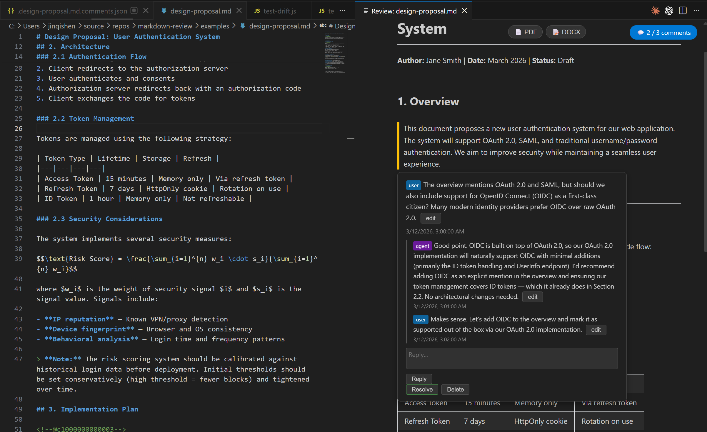

# Markdown Reader with Copilot

**The most agent-friendly document review extension for VS Code and Cursor.**

Review and comment on **Markdown**, **Word (.docx)**, and **PowerPoint (.pptx)** documents — directly inside VS Code and Cursor. Add inline comments, reply in threads, resolve discussions, and let AI agents participate via 12 built-in Copilot tools, MCP server integration, and one-click ✨ Ask Copilot buttons.

[](https://opensource.org/licenses/MIT)

---

## Supported Formats

| Format | Preview | Comments | AI Tools | Save |
|--------|---------|----------|----------|------|
| **Markdown** (.md) | ✅ Rich rendering (KaTeX, Mermaid, GFM) | ✅ Block-level anchored | ✅ Full | PDF, DOCX export |
| **Word** (.docx) | ✅ Full document with styles | ✅ Native Word comments + review | ✅ Full + XML editing | ✅ Save .docx |
| **PowerPoint** (.pptx) | ✅ Slide rendering with shapes | ✅ Shape-level overlays | ✅ Full + XML editing + slide capture | ✅ Save .pptx |

---

## Quick Start

### 1. Open a Preview
- **Markdown**: Open any `.md` file → press **`Ctrl+Shift+R`** (Mac: `Cmd+Shift+R`), or right-click → **"Document Review: Open Markdown Preview"**
- **Word**: Right-click a `.docx` file in Explorer → **"Document Review: Open Word Document Preview"**
- **PowerPoint**: Right-click a `.pptx` file in Explorer → **"Document Review: Open PowerPoint Preview"**

### 2. Add Review Comments
- **Markdown**: Click the **`+`** gutter button next to any block
- **Word**: Click the **`+`** gutter button next to any paragraph
- **PowerPoint**: Hover over any shape and click **`+`**, or click **`+`** on slide corner

### 3. Enable AI Agent Tools
In **Copilot Agent Mode**, click **Tools** and enable the Document Review tools (prefixed with `#`). Then ask:
> *"Review this document and respond to all open comments"*

---

## Features

### Rich Rendering
- **Markdown**: KaTeX math, Mermaid diagrams, GFM tables, syntax highlighting
- **Word**: Full document rendering with styles, images, tables, lists, math formulas (OMML → KaTeX)
- **PowerPoint**: Slide-by-slide rendering with shapes, text, colors, speaker notes

### Inline Commenting
- **"+" buttons** — Add comments on any block (markdown), paragraph (Word), or shape (PowerPoint)
- **Comment highlighting** — Commented elements are highlighted (yellow for review, green for Word native, blue for PPTX)
- **Popover details** — Click to see comment, replies, and actions (Reply, Resolve, Edit, Delete, ✨ Ask Copilot)
- **Sidebar panel** — Search, filter (All/Open/Resolved/User/Agent), and bulk actions

### Native Comment Integration
- **Word**: Reads existing Word comments with author names and threading
- **PowerPoint**: Reads existing PPTX comments with author names
- Reply to native comments via sidecar — original document comments are preserved

### Document Editing (Word & PowerPoint)
- XML files are extracted for agent editing
- **File watcher** detects changes → auto-refreshes preview
- **Save button** repacks modified XML back into .docx/.pptx
- Copilot prompts include XML editing rules and format-specific guidance

### 12 AI Agent Tools

| Tool | Description | Formats |
|------|-------------|---------|
| `#listReviewComments` | List all comments with status and context | All |
| `#readReviewComment` | Read comment with replies and surrounding context | All |
| `#replyToReviewComment` | Reply to a comment as agent | All |
| `#resolveReviewComment` | Mark a comment as resolved | All |
| `#deleteReviewComment` | Delete a comment and its anchor | All |
| `#scrollToReviewComment` | Scroll preview/editor to a comment | All |
| `#captureReviewScreenshot` | Capture rendered preview as HTML | MD, Word |
| `#captureSlide` | Capture a slide as PNG image | PPTX |
| `#listElements` | List document elements with IDs | Word |
| `#readElementXml` | Read raw XML of a document element | Word |
| `#writeElementXml` | Replace an element's XML | Word |
| `#saveDocument` | Save changes back to .docx | Word |

### Export
- **PDF** — One-click export via Chrome headless (markdown)
- **DOCX** — One-click export via Pandoc with native Word equations (markdown)
- **Save .docx** — Save modified Word document back to file
- **Save .pptx** — Save modified PowerPoint back to file

### Cross-Reference Navigation (Markdown)
- **Preview → Source**: Double-click any block to jump to source
- **Source → Preview**: Cursor movement syncs preview scroll

---

## Cursor Support

Full support in **Cursor IDE** via an embedded MCP server that registers automatically.

- All preview, commenting, and export features work natively
- AI tools delivered via MCP server (12 tools registered in `~/.cursor/mcp.json`)
- **✨ Ask Copilot** copies prompt to clipboard → paste in Composer

---

## Architecture

```
src/
  extension.ts    — Commands, editor detection, tool/MCP registration
  preview.ts      — Webview panel for all 3 formats
  comment-ui.ts   — Shared comment UI (CSS, JS, prompts) for all formats
  comments.ts     — CommentsManager for JSON sidecar CRUD
  tools.ts        — 12 Copilot tool implementations
  mcp-server.ts   — MCP server (12 tools for Cursor & MCP clients)
  docx-parser.ts  — Word document parser (OOXML → HTML)
  pptx-parser.ts  — PowerPoint parser (OOXML → slide model)
media/
  pptx-viewer.js  — PPTX renderer (browser-native slide rendering)
  html-to-image.min.js — DOM-to-PNG capture (for slide screenshots)
  mermaid.min.js  — Mermaid diagram renderer
```

---

## Development

```bash
npm install
npx esbuild src/extension.ts --bundle --outfile=out/extension.js --format=cjs --platform=node --external:vscode
npx vsce package --no-dependencies --allow-missing-repository
```

### Run tests
```bash
node test/test-comment-ui.js        # Unit tests for shared comment UI
node test/test-slide-capture.js     # E2E slide capture (requires Playwright)
node test/test-scroll-exact.js      # E2E click-to-scroll
```

---

## Requirements

- **VS Code** 1.93.0+ or **Cursor** (latest)
- **Chrome** (optional) — for PDF export
- **Pandoc** (optional) — for DOCX export from markdown

---

## Version History

| Version | Highlights |
|---------|-----------|
| **5.0.0** | 🎉 PowerPoint (.pptx) support: slide rendering, shape-level commenting, XML editing, slide capture as PNG, save .pptx. Shared comment UI module. KaTeX math in Word preview. 12 tools (was 7). |
| **4.5.x** | Word (.docx) support: preview, native comments, XML editing, save .docx |
| **4.1.x** | Cursor IDE support via MCP server |
| **4.0.0** | ✨ Ask Copilot buttons, popover persistence, DOCX table borders |
| **3.7.x** | Mermaid diagrams, Ctrl+Shift+R keybinding |
| **3.0.x** | 7 Copilot tools for agent mode |
| **2.1.0** | First stable release — anchor-based commenting |

---

## License

[MIT](LICENSE)
# Markdown Reader with Copilot

**The most agent-friendly markdown reader and review extension for VS Code and Cursor.**

Markdown Reader with Copilot brings Quip/Google Docs-style inline commenting to your markdown files — directly inside VS Code and Cursor. Read, preview, comment, reply in threads, resolve discussions, and let AI agents participate in the review via 7 built-in Copilot tools and one-click ✨ Ask Copilot buttons. Perfect for document reviews, design proposals, and technical specifications.

[](https://opensource.org/licenses/MIT)

---

## Quick Start

<!--@c1773552062764-->
### 1. Open a Review Preview
Open any `.md` file and press **`Ctrl+Shift+R`** (Mac: `Cmd+Shift+R`), or right-click → **"Markdown Review: Open Preview with Comments"**.

### 2. Add Review Comments
<!--@c1773552169188-->
In the preview, click the **`+`** button in the gutter next to any block (heading, paragraph, table, formula, list, blockquote) to add a comment. Reply to comments, edit them, or mark them resolved — all inline. You can also click **✨ Ask Copilot** instead of "Add Comment" to post your comment and immediately get an AI response, or click **✨ Ask Copilot** next to "Reply" to send the entire thread to Copilot.

### 3. Enable AI Agent Tools
In **Copilot Agent Mode** (the chat panel), click the **Tools** button and enable the 7 Markdown Review tools (they start with `#listReviewComments`, `#readReviewComment`, etc.). Now you can ask the agent:
> *"Review this document and respond to all open comments"*

The agent will list comments, read context, post replies, and resolve items — all autonomously.

> 💡 **Cursor IDE** is also supported — see [Cursor Support](#cursor-support) for setup details.

---

## Features



### Rich Rendering
- **LaTeX Math** — Full support for `$inline$` and `$$display$$` math formulas via KaTeX
- **Mermaid Diagrams** — Sequence diagrams, flowcharts, gantt charts, class diagrams, state diagrams, and more rendered natively in the preview
- **GitHub Flavored Markdown** — Tables, task lists, strikethrough via remark-gfm
- **Syntax Highlighting** — Code blocks with language-specific formatting

### Inline Commenting
- **"+" gutter buttons** — Click the `+` button next to any block (heading, paragraph, table, formula, list item, blockquote) to add a review comment
- **Comment highlighting** — Commented blocks are highlighted with a yellow border
- **Popover details** — Click a highlighted block to see the comment, replies, and actions
- **Sidebar comment list** — Click the comment badge to see all comments in a panel
- **✨ Ask Copilot** — One-click button next to "Add Comment" and "Reply" to send the comment/thread to Copilot Agent Mode for an AI response

### Threaded Replies with Roles
- Reply to any comment from the popover or sidebar
- **User** and **Agent** role badges — user comments show a blue badge, agent replies show purple
- Edit comments and replies inline

### Cross-Reference Jumping
- **Preview → Source**: Double-click any block in the preview to jump to that line in the editor (also available via right-click → "Jump to Source")
- **Source → Preview**: Move your cursor in the editor and the preview scrolls to match

### Export
- **PDF Export** — One-click export via Chrome headless. Supports KaTeX formulas, Mermaid diagrams, tables, and all formatting. No headers/footers.
- **DOCX Export** — One-click export via Pandoc with native Word equations (OMML). Mermaid diagrams rendered as high-resolution (2x DPI) PNG images via Chrome headless.

### 7 Copilot Tools for Agent Mode
This is what makes Markdown Review uniquely **agent-friendly**. When you enable the extension's tools in Copilot Agent Mode, AI agents can:

| Tool | Description |
|---|---|
| `#listReviewComments` | List all comments with status, context, and reply count |
| `#readReviewComment` | Read a comment with replies and surrounding markdown context |
| `#replyToReviewComment` | Reply to a comment as `agent` role |
| `#resolveReviewComment` | Mark a comment as resolved |
| `#deleteReviewComment` | Delete a comment and remove its anchor |
| `#scrollToReviewComment` | Scroll preview and editor to a comment's location |
| `#captureReviewScreenshot` | Export the rendered preview as HTML for visual inspection |

**Example workflow:**
```
User: "Review the design proposal and respond to all open comments"
Agent: [calls #listReviewComments] → sees 3 open comments
       [calls #readReviewComment for each] → reads context
       [calls #replyToReviewComment] → posts agent replies
       [calls #resolveReviewComment] → resolves addressed items
```

**✨ Ask Copilot buttons** — You can also trigger Copilot directly from the review UI:
- **Add Comment dialog** → Click **"✨ Ask Copilot"** instead of "Add Comment" to post your comment AND immediately open Copilot chat with the block context so the agent can respond
- **Reply area** (popover & sidebar) → Click **"✨ Ask Copilot"** to send the entire comment thread to Copilot for an AI reply

The agent receives the comment text, block context, and all existing replies, then uses the review tools to read full context and post its response.

### Anchor System
Comments are anchored to specific blocks in the markdown source using invisible HTML comments (`<!--@cXXX-->`). Anchors:
- Are placed on their own line before the target block
- Move with the content when you edit the document
- Are stripped during rendering so they don't affect the preview
- Are invisible in standard markdown renderers (GitHub, VS Code preview, etc.)

> **Note on file impact:** This extension creates two things in your workspace:
> 1. **Anchors** (`<!--@cXXX-->`) inserted into the markdown file — these are standard HTML comments and are **completely invisible** to all markdown compilers, renderers, and viewers (GitHub, Pandoc, VS Code preview, Jekyll, Hugo, etc.). Your markdown compiles and renders identically with or without them.
> 2. **A sidecar comment file** (`.filename.md.comments.json`) — a dot-prefixed JSON file stored next to the markdown. It contains all comment data and is hidden on macOS/Linux. You can safely `.gitignore` it or commit it for shared reviews.

<!--@c1773466551259-->
### Additional Features
- **Keyboard shortcut**: `Ctrl+Shift+R` to open review preview
- **Right-click menu**: Available in both editor and file explorer
- **Comment persistence**: Comments stored in a dot-prefixed JSON sidecar file (`.filename.md.comments.json`)
- **KaTeX math rendering**: Full support for `$inline$` and `$$display$$` math
- **GFM support**: Tables, task lists, strikethrough via remark-gfm
- **Debounced auto-render**: Preview updates automatically as you edit

---

## Navigation Tips

- **Preview → Source**: **Double-click** any block in the preview to jump to that line in the editor
- **Source → Preview**: Move your cursor in the editor — the preview scrolls to the matching block with a brief blue highlight
- The keyboard shortcut `Ctrl+Shift+R` is customizable via **Preferences: Open Keyboard Shortcuts** (`Ctrl+K Ctrl+S`)

---

## Example

See the [examples/](examples/) folder for a sample design proposal with threaded comments and agent replies.

The example includes:
- A design proposal document with headings, tables, formulas, and blockquotes
- 3 review comments with threaded replies between user and agent
- Demonstrates resolved vs. open comments

---

## Cursor Support

This extension works in **Cursor IDE** with full preview and commenting support. AI features are delivered via an embedded MCP server that registers automatically on install.

### What works natively in Cursor
- **Preview rendering** — all markdown, KaTeX math, Mermaid diagrams, images
- **Inline commenting** — add, edit, delete, reply, resolve comments
- **Cross-reference jumping** — preview ↔ source navigation
- **PDF / DOCX export** — same as VS Code
- **7 AI tools via MCP** — the extension auto-registers an MCP server (`markdown-review`) in `~/.cursor/mcp.json`. After install, go to **Cursor Settings → Features → MCP Servers** and verify it’s toggled ON. Switch chat to **Agent** mode to use the tools.
- **Live updates** — when the agent replies via MCP, the preview updates automatically

### What uses clipboard (Cursor limitation)
- **✨ Ask Copilot button** — Cursor does not expose an API to inject text into the Composer. When you click ✨ Ask Copilot, the prompt is copied to your clipboard and the Composer panel opens. Paste with `Ctrl+V` and press Enter. A modal notification confirms the prompt was copied.

---

## Requirements

- **VS Code** 1.93.0 or later, or **Cursor** (latest recommended)
- **Chrome** (optional) — for PDF export via headless mode
- **Pandoc** (optional) — for DOCX export with native Word equations ([install](https://pandoc.org/installing.html))

---

## Extension Settings

No configuration needed. The extension activates automatically for markdown files.

---

## Architecture

```
src/
  extension.ts   — Command registration, editor detection, tool/MCP registration
  preview.ts     — Webview panel with remark/rehype rendering pipeline
  comments.ts    — CommentsManager for JSON sidecar CRUD
  tools.ts       — 7 Copilot tool implementations (VS Code)
  mcp-server.ts  — MCP server exposing the same 7 tools (Cursor & other MCP clients)
```

**Rendering pipeline:** Markdown → remark-parse → remark-gfm → remark-math → remark-rehype → rehype-raw → rehype-katex → rehype-stringify → HTML

**Offset system:** All block positions use clean-text offsets (anchor-free, LF-normalized). The extension maintains bidirectional mapping between clean offsets and document offsets (with anchors, CRLF-aware).

---

## Development

```bash
# Install dependencies
npm install

# Build
npx esbuild src/extension.ts --bundle --outfile=out/extension.js --format=cjs --platform=node --external:vscode

# Package
npx vsce package --no-dependencies --allow-missing-repository

# Run tests
node test/test-crlf-fix.js
node test/test-crossref.js
```

---

## Version History

| Version | Highlights |
|---|---|
| **4.1.x** | Cursor IDE support via MCP server, comments file watcher for live updates, DOCX image fix, modal notifications |
| **4.0.0** | ✨ Ask Copilot buttons (Add Comment + Reply), popover persistence, data URI images, DOCX table borders, reply delete with confirmation dialogs |
| **3.7.x** | Quick Start section, Ctrl+Shift+R keybinding, Mermaid diagrams, preview as new tab |
| **3.2.x** | Context menus, keybinding, dot-prefixed comments file, DOCX export |
| **3.1.x** | PDF export via Chrome headless with KaTeX support |
| **3.0.x** | 7 Copilot tools for agent mode |
| **2.4.x** | Comment editing, reply editing, inline edit buttons |
| **2.3.x** | Comment replies with user/agent roles |
| **2.2.0** | Cross-reference jumping between source and preview |
| **2.1.0** | First stable release — anchor-based commenting with CRLF support |

---

## License

[MIT](LICENSE)
