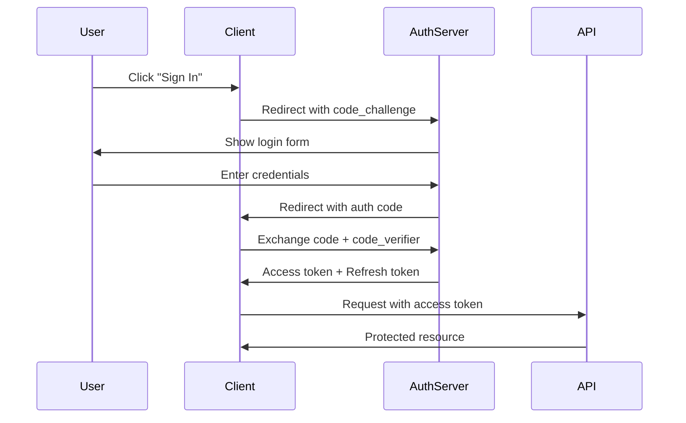
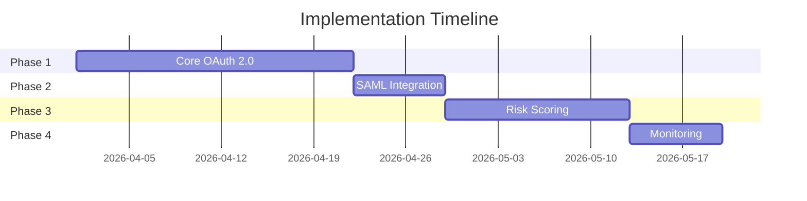

# Design Proposal: User Authentication System

**Author:** Jane Smith | **Date:** March 2026 | **Status:** Draft

---

## 1. Overview

<!--@c1000000000001-->
This document proposes a new user authentication system for our web application. The system will support OAuth 2.0, SAML, and traditional username/password authentication. We aim to improve security while maintaining a seamless user experience.

## 2. Architecture

### 2.1 Authentication Flow

<!--@c1000000000002-->
The authentication flow follows a standard OAuth 2.0 authorization code flow:

1. User clicks "Sign In" on the client application
2. Client redirects to the authorization server
3. User authenticates and consents
4. Authorization server redirects back with an authorization code
5. Client exchanges the code for tokens

### 2.2 Token Management

Tokens are managed using the following strategy:

| Token Type | Lifetime | Storage | Refresh |
|---|---|---|---|
| Access Token | 15 minutes | Memory only | Via refresh token |
| Refresh Token | 7 days | HttpOnly cookie | Rotation on use |
| ID Token | 1 hour | Memory only | Not refreshable |

### 2.3 Security Considerations

The system implements several security measures:

$$\text{Risk Score} = \frac{\sum_{i=1}^{n} w_i \cdot s_i}{\sum_{i=1}^{n} w_i}$$

where $w_i$ is the weight of security signal $i$ and $s_i$ is the signal value. Signals include:

- **IP reputation** — Known VPN/proxy detection
- **Device fingerprint** — Browser and OS consistency
- **Behavioral analysis** — Login time and frequency patterns

> **Note:** The risk scoring system should be calibrated against historical login data before deployment. Initial thresholds should be set conservatively (high threshold = fewer blocks) and tightened over time.

## 3. Implementation Plan

<!--@c1000000000003-->
- Phase 1: Core OAuth 2.0 implementation (2 weeks)
- Phase 2: SAML integration (1 week)
- Phase 3: Risk scoring system (2 weeks)
- Phase 4: Monitoring and alerting (1 week)

## 4. Open Questions

1. Should we support passwordless authentication in Phase 1?
2. What is the SLA requirement for the authentication service?
3. How should we handle token revocation across distributed services?
